# ch1 Probability and Distributions

## 1.2 Set Theory

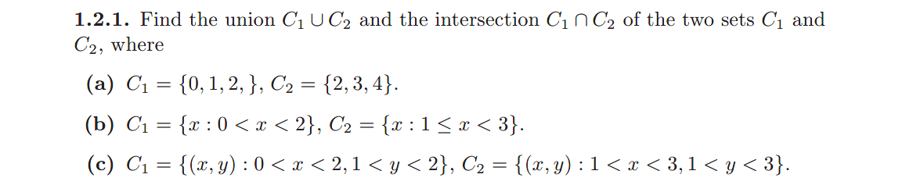

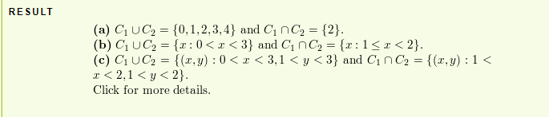

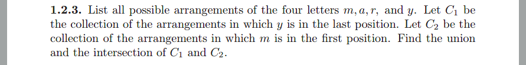

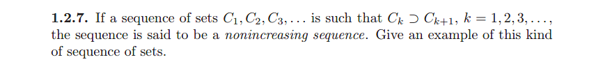

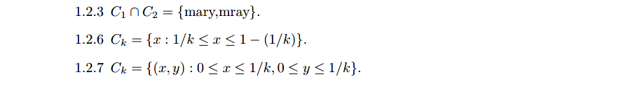

## 1.3 The Probability Set Function

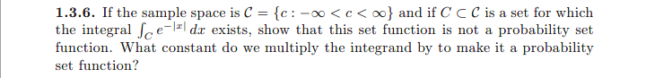

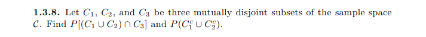

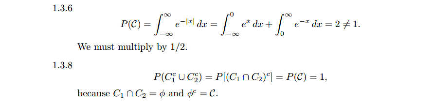

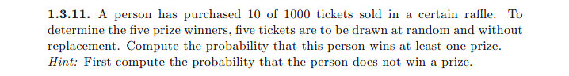

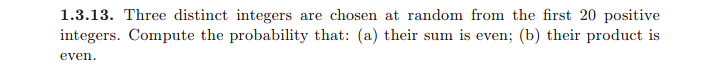

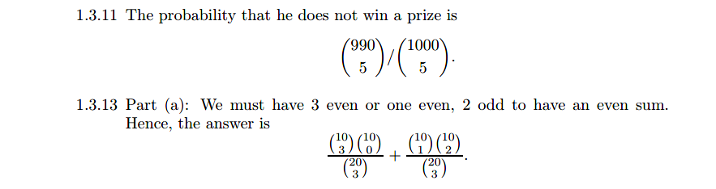

## 1.4 Conditional Probability and Independence

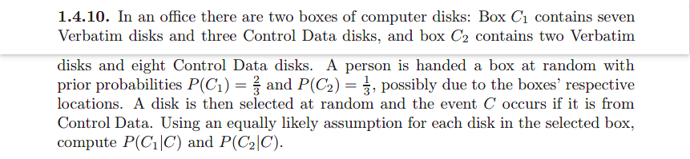

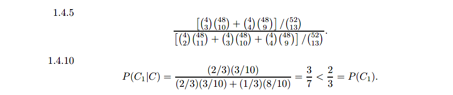

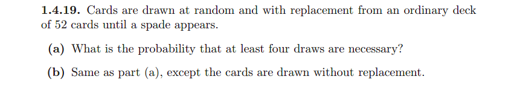

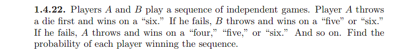

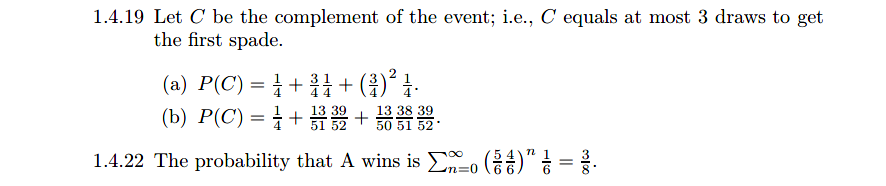

## 1.5 Random Variables

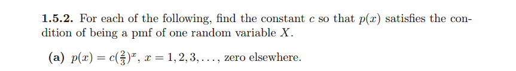

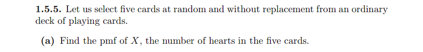

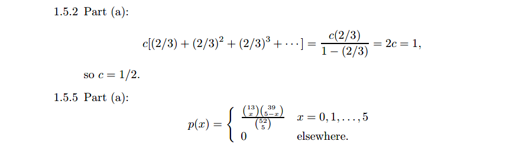

## 1.6 Discrete Random Variables

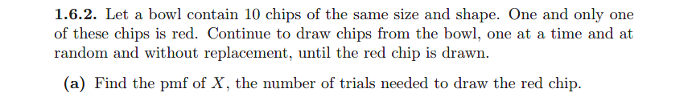

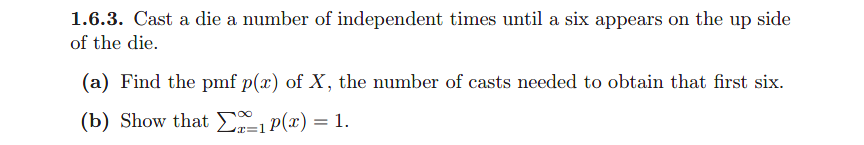

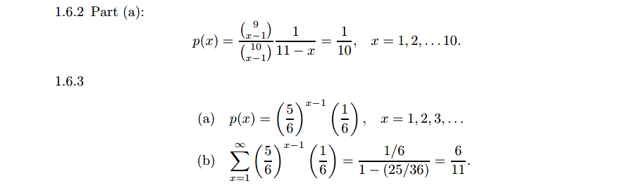

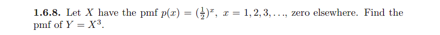

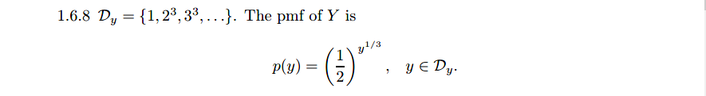

## 1.7 Continuous Random Variables

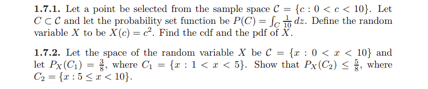

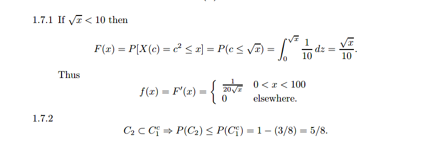

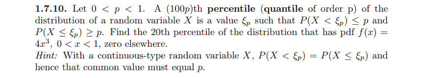

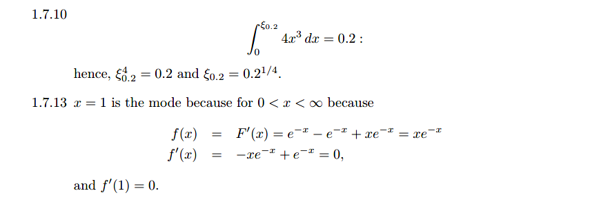

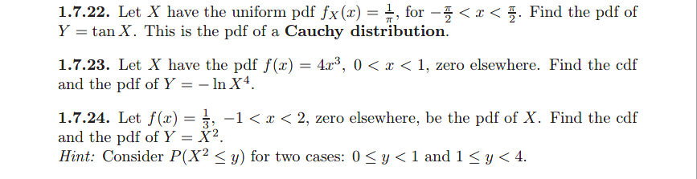

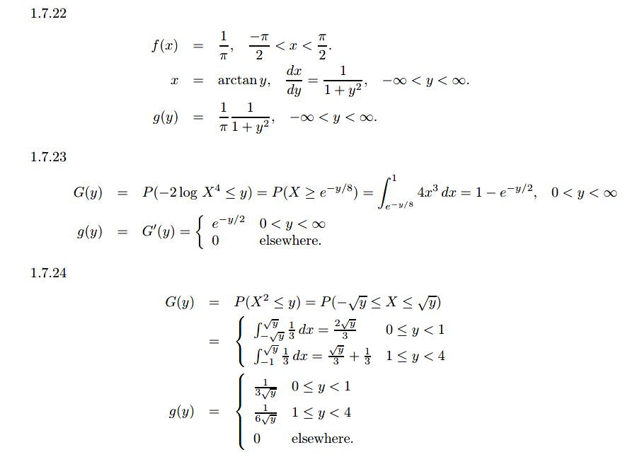

## 1.8 Expectation of a Random Variable

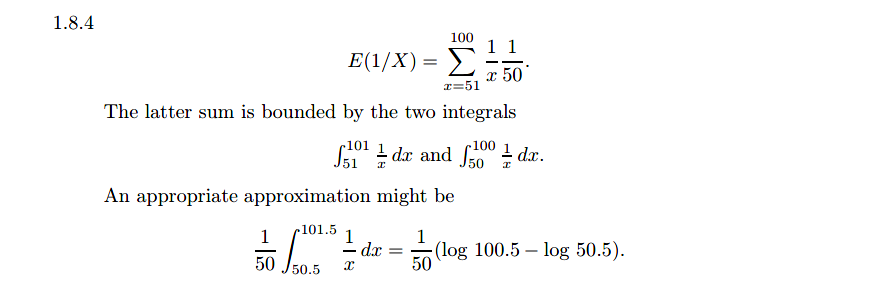

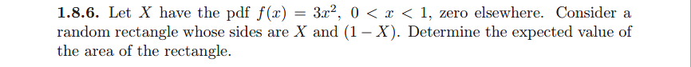

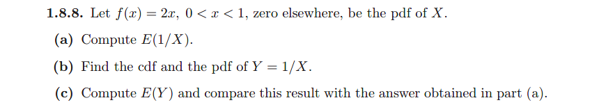

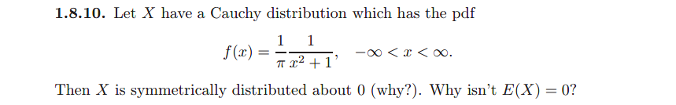

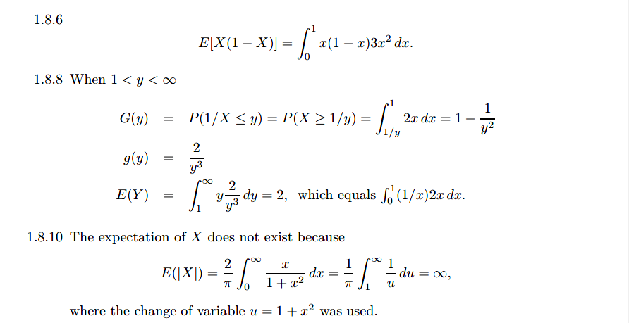

## 1.9 Some Special Expectations

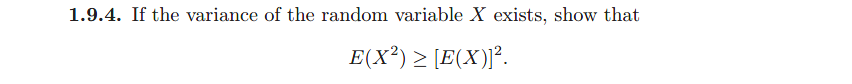

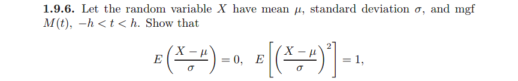

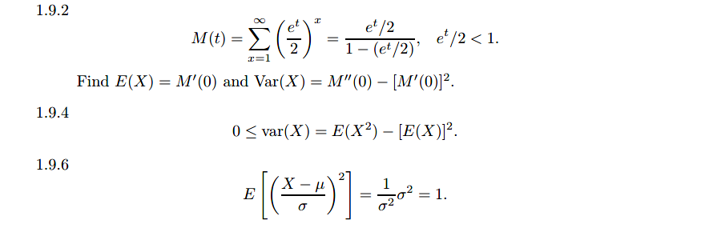

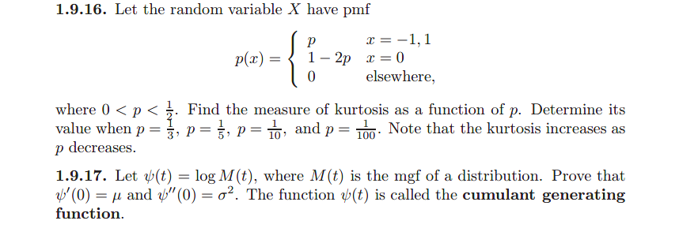

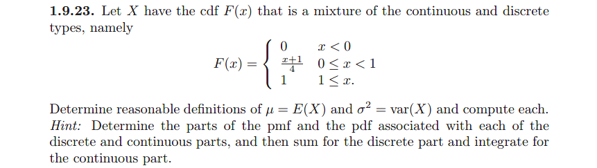

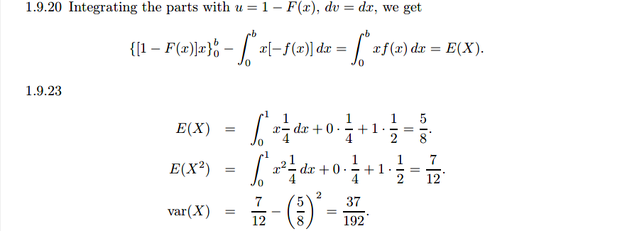

## 1.10 Important Inequalities

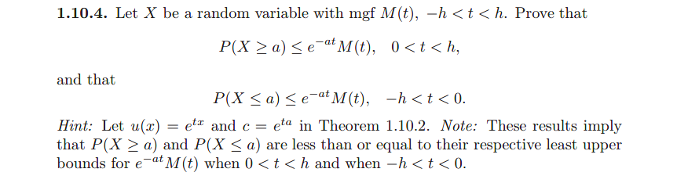

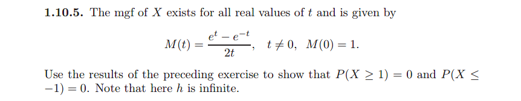

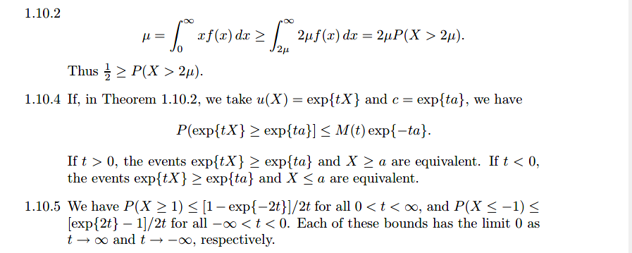