# Multivariate Distributions

## 1

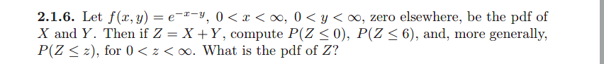

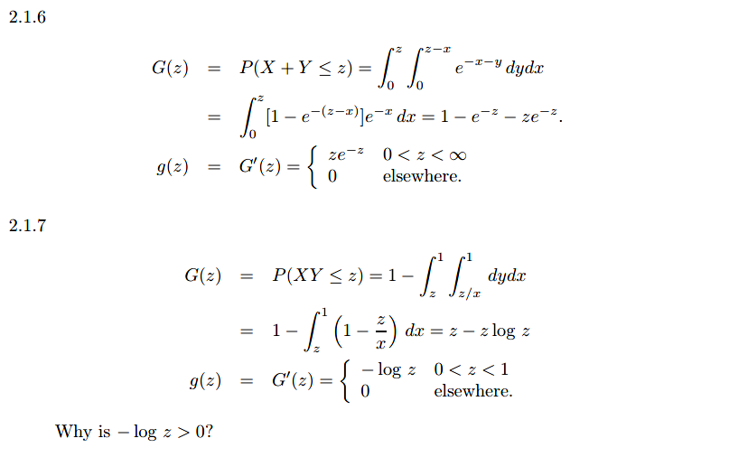

## 2

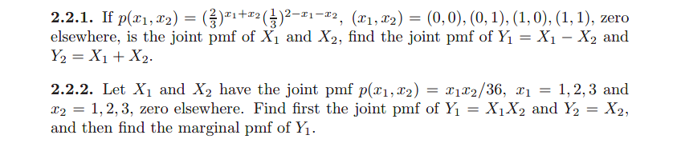

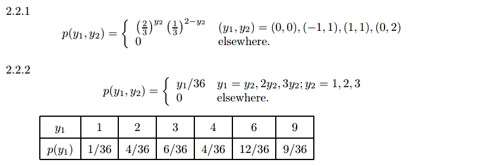

## 3

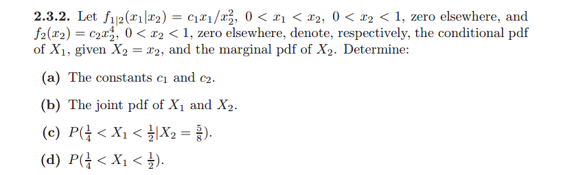

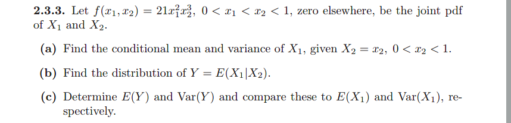

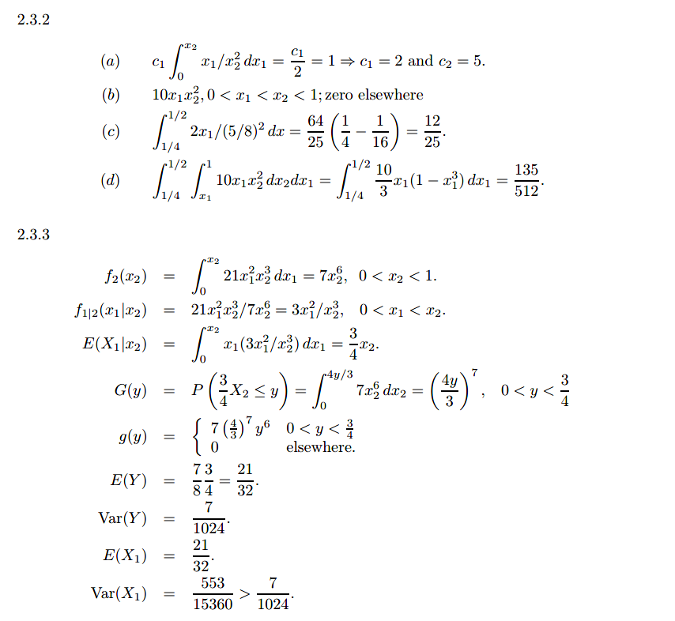

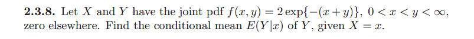

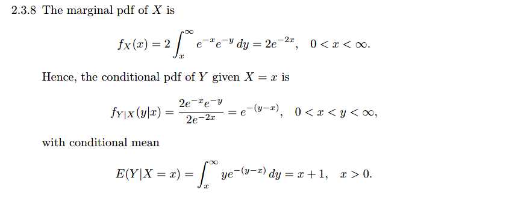

## 4

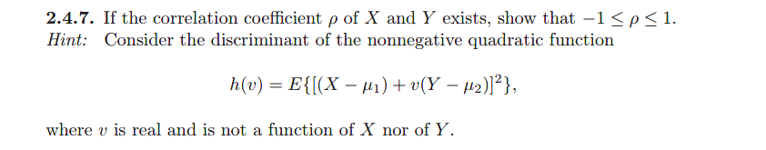

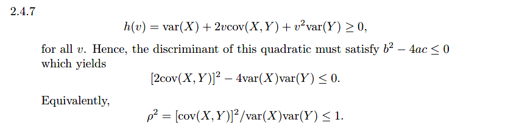

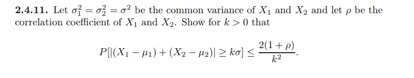

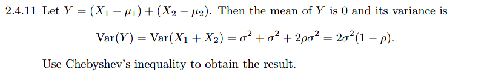

## 5

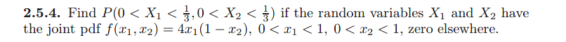

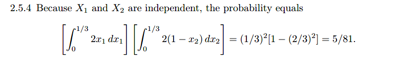

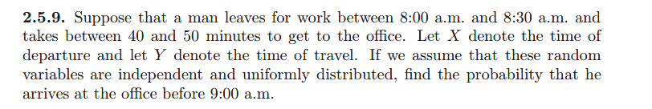

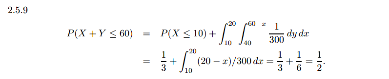

## 6

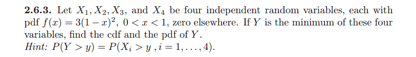

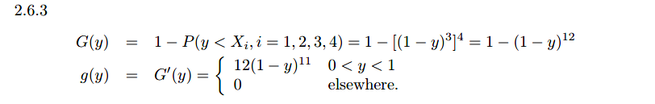

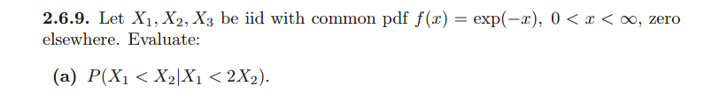

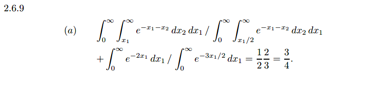

## 7

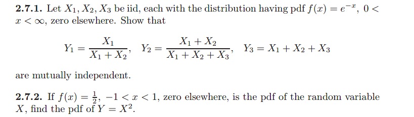

## 8

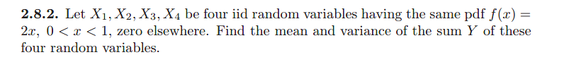

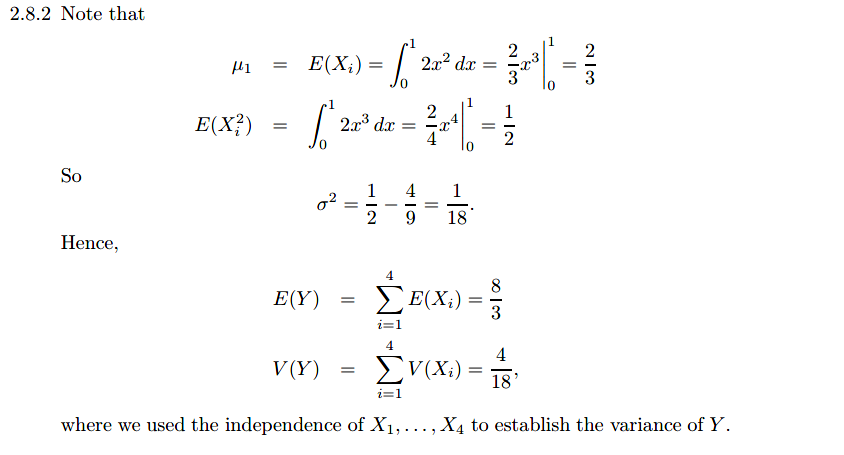

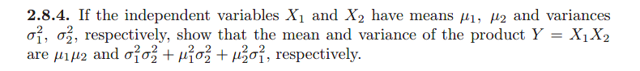

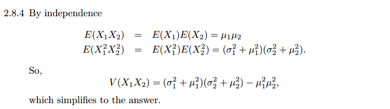

# Some Special Distributions

## 1

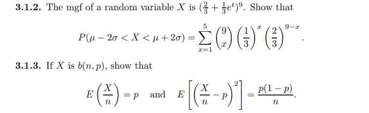

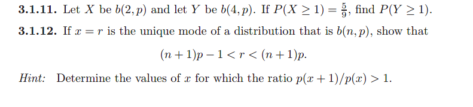

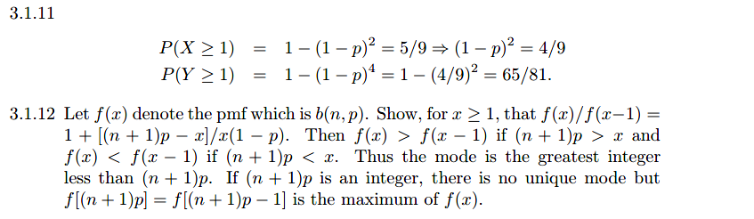

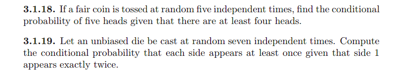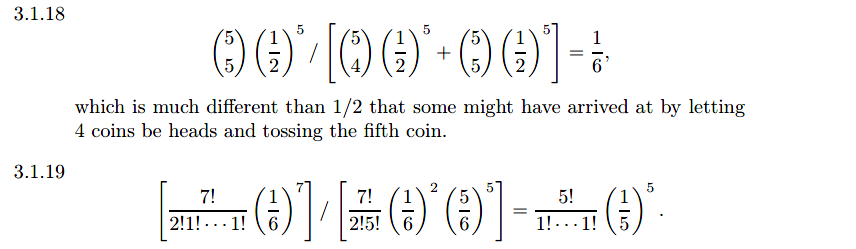

## 2

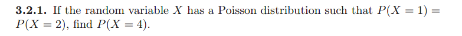

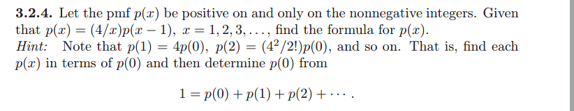

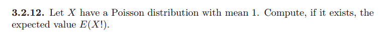

## 3

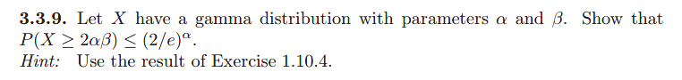

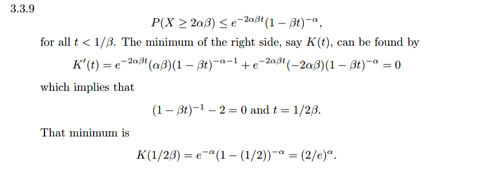

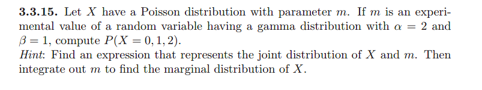

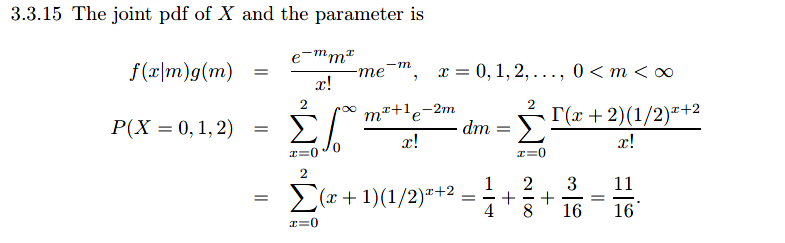

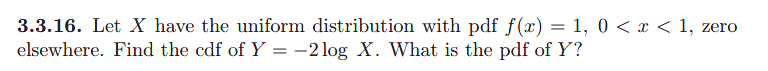

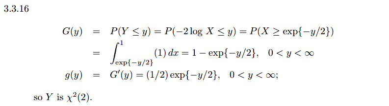

## 4

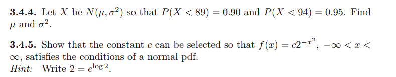

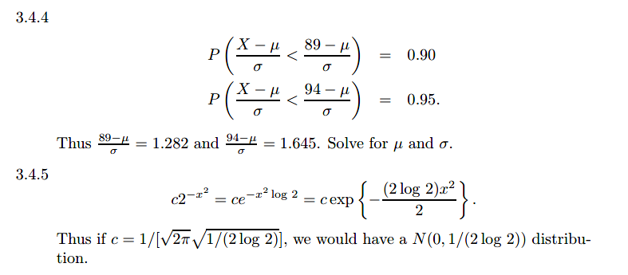

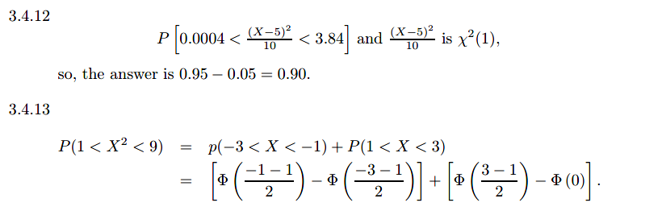

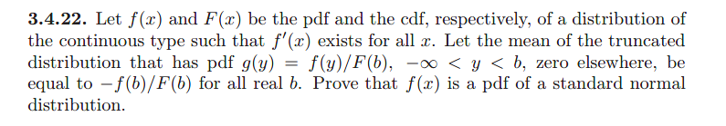

## 5

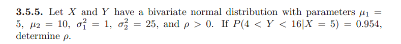

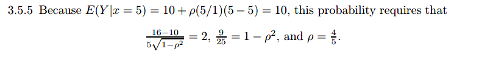

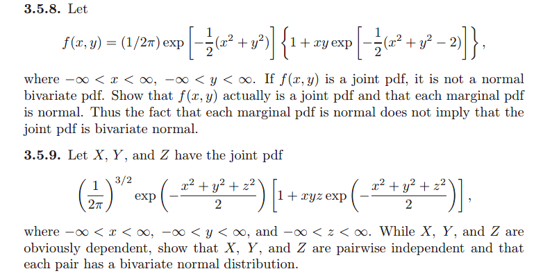

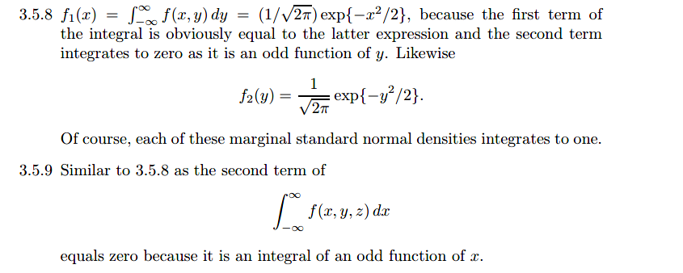

## 6

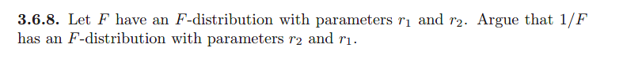

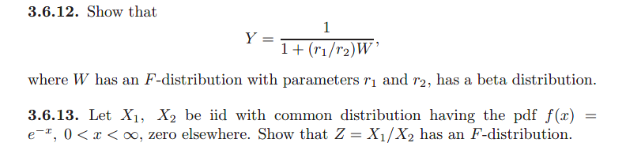

## 7

# Some Elementary Statistical Inferences

## 1

## 2

## 3

## 5

## 6

## 7

