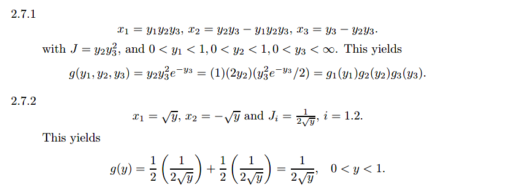
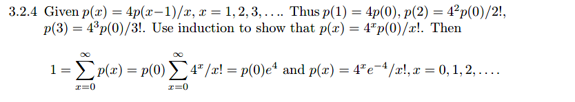
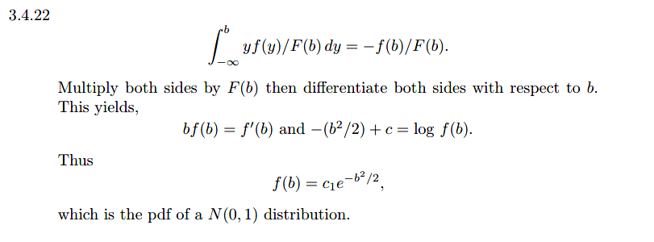
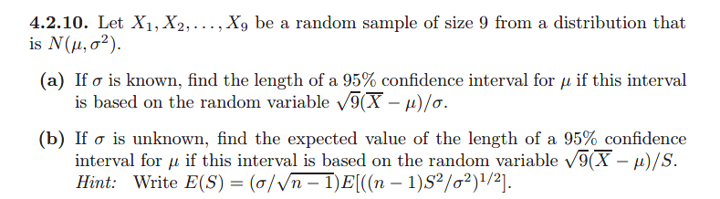
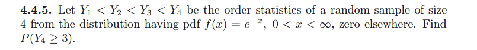
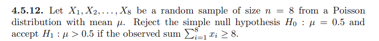

# Multivariate Distributions

## 1

## 2

## 3

## 4

## 5

## 6

## 7

## 8

# Some Special Distributions

## 1

## 2

## 3

## 4

## 5

## 6

## 7

# Some Elementary Statistical Inferences

## 1

## 2

## 3

## 5

## 6

## 7

